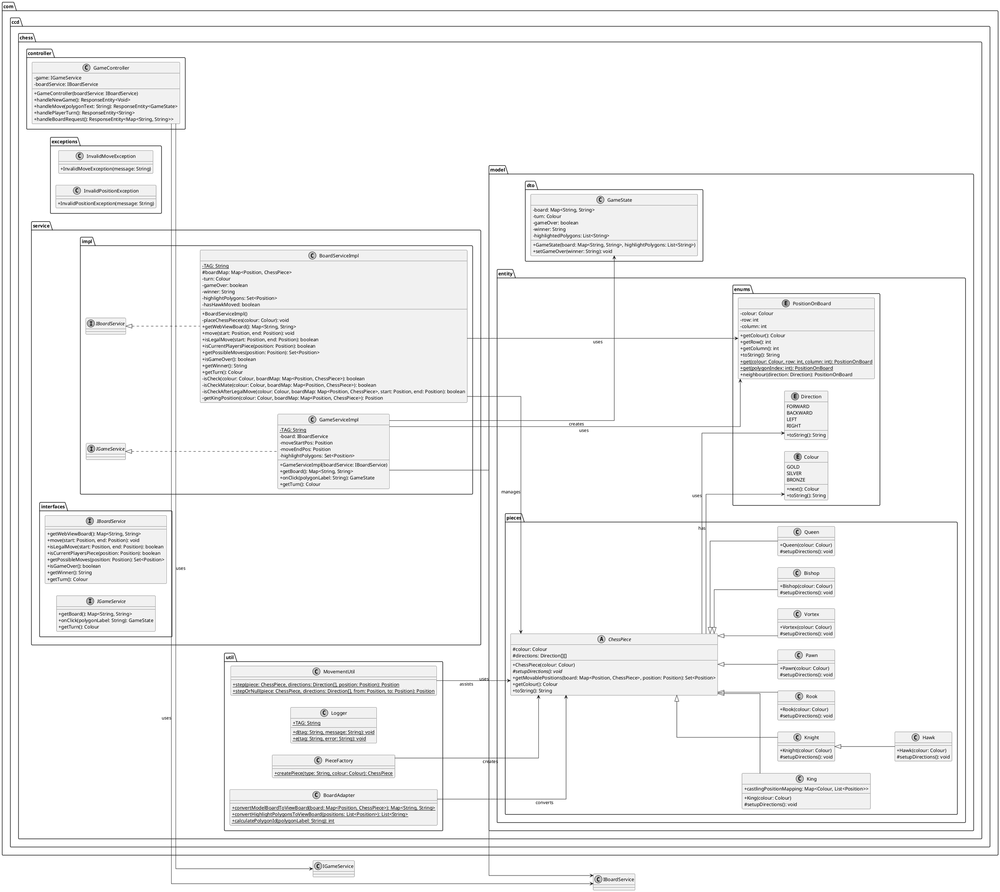

```plantuml
@startuml
' Set theme and styling
skinparam backgroundColor transparent
skinparam classAttributeIconSize 0
skinparam monochrome true
skinparam linetype ortho

' Set direction for better layout
left to right direction

' Package com.ccd.chess
package "com.ccd.chess" {
    ' Controller package
    package "controller" {
        class GameController {
            - game: IGameService
            - boardService: IBoardService
            + GameController(boardService: IBoardService)
            + handleNewGame(): ResponseEntity<Void>
            + handleMove(polygonText: String): ResponseEntity<GameState>
            + handlePlayerTurn(): ResponseEntity<String>
            + handleBoardRequest(): ResponseEntity<Map<String, String>>
        }
    }

    ' Exceptions package
    package "exceptions" {
        class InvalidMoveException {
            + InvalidMoveException(message: String)
        }
        class InvalidPositionException {
            + InvalidPositionException(message: String)
        }
    }

    ' Model package
    package "model" {
        package "dto" {
            class GameState {
                - board: Map<String, String>
                - turn: Colour
                - gameOver: boolean
                - winner: String
                - highlightedPolygons: List<String>
                + GameState(board: Map<String, String>, highlightPolygons: List<String>)
                + setGameOver(winner: String): void
            }
        }

        package "entity" {
            package "pieces" {
                abstract class ChessPiece {
                    # colour: Colour
                    # directions: Direction[][]
                    + ChessPiece(colour: Colour)
                    # {abstract} setupDirections(): void
                    + getMovablePositions(board: Map<Position, ChessPiece>, position: Position): Set<Position>
                    + getColour(): Colour
                    + toString(): String
                }

                class Bishop extends ChessPiece {
                    + Bishop(colour: Colour)
                    # setupDirections(): void
                }
                class Queen extends ChessPiece {
                    + Queen(colour: Colour)
                    # setupDirections(): void
                }
                class King extends ChessPiece {
                    + castlingPositionMapping: Map<Colour, List<Position>>
                    + King(colour: Colour)
                    # setupDirections(): void
                }
                class Knight extends ChessPiece {
                    + Knight(colour: Colour)
                    # setupDirections(): void
                }
                class Rook extends ChessPiece {
                    + Rook(colour: Colour)
                    # setupDirections(): void
                }
                class Pawn extends ChessPiece {
                    + Pawn(colour: Colour)
                    # setupDirections(): void
                }
                class Hawk extends Knight {
                    + Hawk(colour: Colour)
                    # setupDirections(): void
                }
                class Vortex extends ChessPiece {
                    + Vortex(colour: Colour)
                    # setupDirections(): void
                }
            }

            package "enums" {
                enum Colour {
                    GOLD
                    SILVER
                    BRONZE
                    + next(): Colour
                    + toString(): String
                }
                enum Direction {
                    FORWARD
                    BACKWARD
                    LEFT
                    RIGHT
                    + toString(): String
                }
                enum PositionOnBoard {
                    - colour: Colour
                    - row: int
                    - column: int
                    + getColour(): Colour
                    + getRow(): int
                    + getColumn(): int
                    + toString(): String
                    + {static} get(colour: Colour, row: int, column: int): PositionOnBoard
                    + {static} get(polygonIndex: int): PositionOnBoard
                    + neighbour(direction: Direction): PositionOnBoard
                }
            }
        }
    }

    ' Service package
    package "service" {
        package "impl" {
            class BoardServiceImpl implements IBoardService {
                - {static} TAG: String
                # boardMap: Map<Position, ChessPiece>
                - turn: Colour
                - gameOver: boolean
                - winner: String
                - highlightPolygons: Set<Position>
                - hasHawkMoved: boolean
                + BoardServiceImpl()
                - placeChessPieces(colour: Colour): void
                + getWebViewBoard(): Map<String, String>
                + move(start: Position, end: Position): void
                + isLegalMove(start: Position, end: Position): boolean
                + isCurrentPlayersPiece(position: Position): boolean
                + getPossibleMoves(position: Position): Set<Position>
                + isGameOver(): boolean
                + getWinner(): String
                + getTurn(): Colour
                - isCheck(colour: Colour, boardMap: Map<Position, ChessPiece>): boolean
                - isCheckMate(colour: Colour, boardMap: Map<Position, ChessPiece>): boolean
                - isCheckAfterLegalMove(colour: Colour, boardMap: Map<Position, ChessPiece>, start: Position, end: Position): boolean
                - getKingPosition(colour: Colour, boardMap: Map<Position, ChessPiece>): Position
            }

            class GameServiceImpl implements IGameService {
                - {static} TAG: String
                - board: IBoardService
                - moveStartPos: Position
                - moveEndPos: Position
                - highlightPolygons: Set<Position>
                + GameServiceImpl(boardService: IBoardService)
                + getBoard(): Map<String, String>
                + onClick(polygonLabel: String): GameState
                + getTurn(): Colour
            }
        }

        package "interfaces" {
            interface IBoardService {
                + getWebViewBoard(): Map<String, String>
                + move(start: Position, end: Position): void
                + isLegalMove(start: Position, end: Position): boolean
                + isCurrentPlayersPiece(position: Position): boolean
                + getPossibleMoves(position: Position): Set<Position>
                + isGameOver(): boolean
                + getWinner(): String
                + getTurn(): Colour
            }

            interface IGameService {
                + getBoard(): Map<String, String>
                + onClick(polygonLabel: String): GameState
                + getTurn(): Colour
            }
        }
    }

    ' Util package
    package "util" {
        class BoardAdapter {
            + {static} convertModelBoardToViewBoard(board: Map<Position, ChessPiece>): Map<String, String>
            + {static} convertHighlightPolygonsToViewBoard(positions: List<Position>): List<String>
            + {static} calculatePolygonId(polygonLabel: String): int
        }

        class Logger {
            + {static} TAG: String
            + {static} d(tag: String, message: String): void
            + {static} e(tag: String, error: String): void
        }

        class MovementUtil {
            + {static} step(piece: ChessPiece, directions: Direction[], position: Position): Position
            + {static} stepOrNull(piece: ChessPiece, directions: Direction[], from: Position, to: Position): Position
        }

        class PieceFactory {
            + {static} createPiece(type: String, colour: Colour): ChessPiece
        }
    }
}

' Relationships
GameController --> IGameService: uses
GameController --> IBoardService: uses
GameServiceImpl --> IBoardService: uses
GameServiceImpl --> GameState: creates
BoardServiceImpl --> ChessPiece: manages
BoardAdapter --> ChessPiece: converts
PieceFactory --> ChessPiece: creates
MovementUtil --> ChessPiece: assists
ChessPiece --> Colour: has
ChessPiece --> Direction: uses
BoardServiceImpl --> PositionOnBoard: uses
GameServiceImpl --> PositionOnBoard: uses
@enduml
``` 